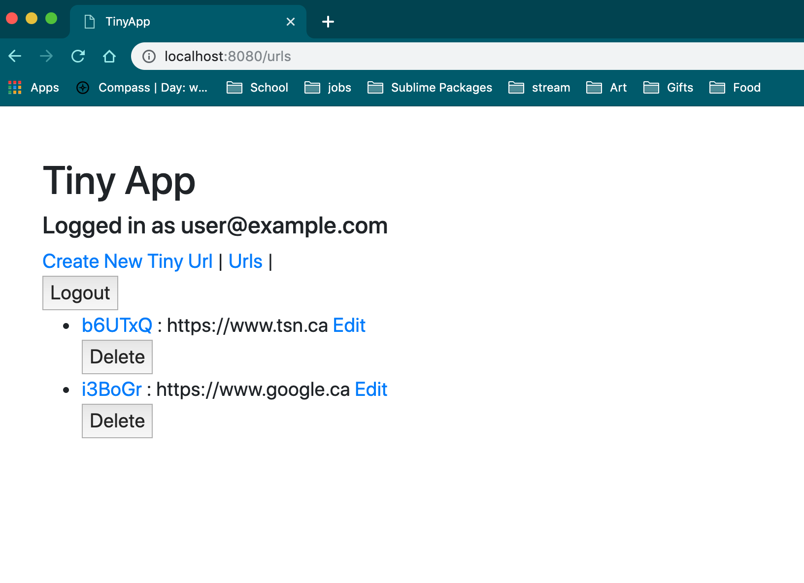
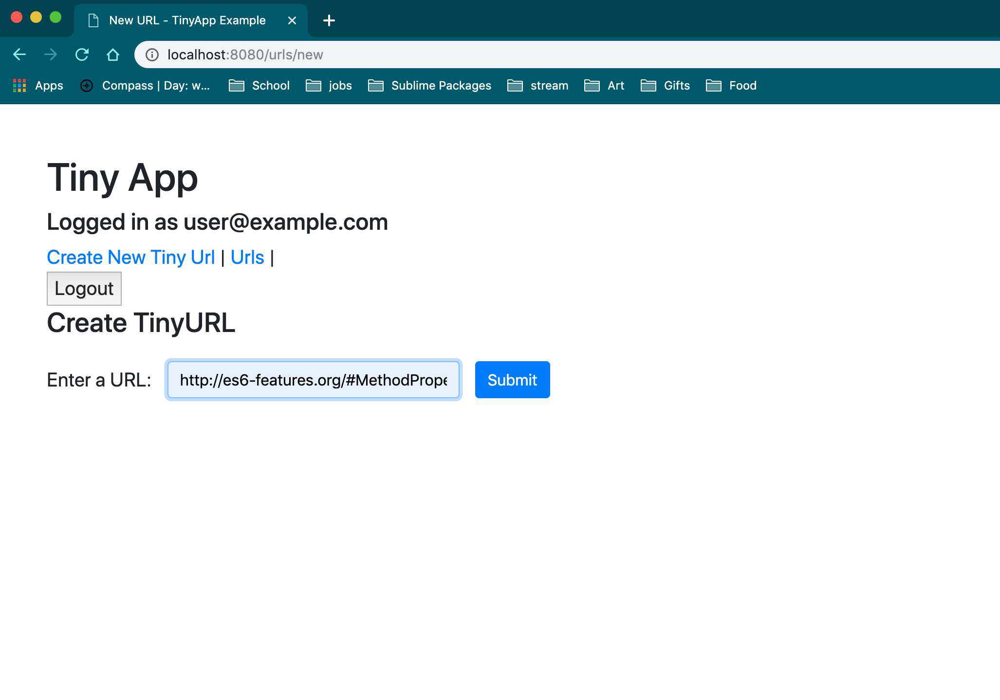
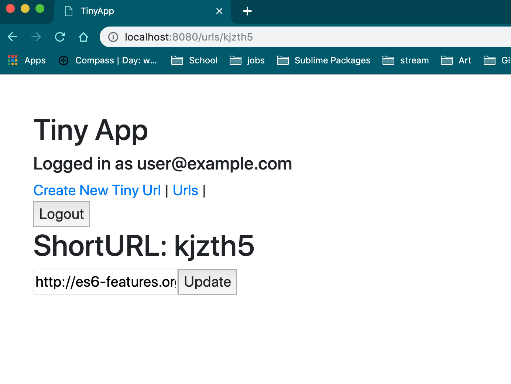

# Tiny-App Project

Tiny app is a full stack web application built with Node and Express that allow users to shorten urls (like bit.ly).

## Final Product

### Urls Index.

### Create new Short urls.

### Urls added to user database.

### Edit previously made urls.

## Dependencies

- Node.js
- Express
- EJS
- bcrypt
- body-parser
- cookie-session

## Getting Started

- Install all dependencies (using the `npm install`).
- Run the development web server using `node express_server.js` command
